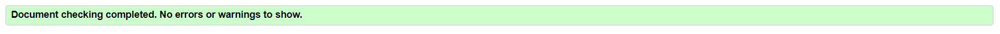

# Human Anatomy Quiz!

# Purpose

The Human Anatomy Quiz aims to provide an engaging and educational experience for those interested in learning about human anatomy. It offers a fun way to test and expand knowledge of anatomical structures and functions through randomly selected questions. The quiz is designed to be interactive and enjoyable, suitable for students, educators, and anyone curious about anatomy. 

# Goal:

The goal of the quiz is to foster a deeper understanding of human anatomy through an interactive and dynamic learning tool. 

[Here's a link to the live website](https://stacykimberley.github.io/anatomy-quiz/)

# UX Design 

## Target audience

People of all ages with a specific interest in the human anatomy.

## User Stories

### As a first time user:

- I want to start the quiz after entering my username.
- I want to answer questions about human anatomy.
- I want to receive immediate feedback on my answers.
- I want to see my progress and score during the quiz.
- I want to retake the quiz if I am not satisfied with my score or just for more fun.
- I want to be able to use the application on different sized screens
- I want the feedback message to be personalised since I added my username.

### As a returning user:

- I want to find new questions added.
- I want to find new challenges added.

## Technologies:

- The quiz is developed using HTML, CSS, and JavaScript for frontend functionality.
- No backend server or database management system is included in the initial scope.

## Assumptions:

- Users have basic familiarity with web browsing and interacting with online quizzes.
- The quiz is designed for educational purposes and does not substitute professional medical advice or training.

## Constraints:

- The development of the quiz is limited to frontend technologies and does not involve server-side processing or data storage.
- Design considerations may be constrained by available resources and development timeframes.

## Structure

### Home Page

#### The home page is the face of the Anatomy Quiz website and has the following features:

- Title of the quiz "How well do you know the human anatomy?"
- Required username input so the user can enter their name before they start the quiz.
- Start button that redirects the user to the first question of the quiz.

### Quiz Page

- Title of the quiz "How well do you know the human anatomy?".
- A question.
- 4 answer options.
- Score area showing how many the user has got correct and incorrect.
- Progress bar to show how far along the quiz the user has gone.
- When answer is selected it highlights green if correct and if wrong it highlights the selected one in red then simultaneously shows you the correct answer.

### Feedback Page.

- Congratulates the user by name for completing the quiz.
- Shows the user their final score.
- Shows a button to retake the quiz if the user wants to.
- Shows the progress bar at complete.

## Wireframes

### Home Page

### Quiz Page

### Feedback Page

## Design

### Background Image

An image from iStock was used as a background image. It's an AI generated image of the immune system defending the body against infections and diseases. 

### Colors

Color pallete was mostly derived from the background image so everything looks well put together and  aesthetically pleasing. They also fit naturally with the human anatomu aesthetic: red for blood, blue reprents life/ water and, black & white provide contrast between the background image and text.

### Font

Only one font (Jura) was used throughout the quiz for uniformity.

## Features

### Home Page

screenshots of username and start button, 

### Quiz Page
quiz correct answer in green, wrong in red, correct score, incorrect score, progress bar

### Feedback Page

congra message, retake button, final correct and incorrect score, completed progress bar

## Responsive Layout

The page is designed to responsive on all screen sizes starting from 344pixels for mobile phones, 768 pixels for tablets and greater than 992pixels so it's aesthetically pleasing for laptops and slightly larger screens.

## Technologies

- HTML for website structure
- CSS to style website
- GitHub to store the source code and GitHub Pages to deploy and host the live site
- Gitpod chosen IDE to develop the website
- Google Fonts
- Font Awesome for icons
- Google Chrome Dev Tools
- Favicon.cc 
- Coolors to choose color palette
- Techsini to create mockup of website on different iOS devices
- Google chrome Lighthouse
- Screen Reader for Google Chrome
- Colorfilter
- W3C HTML Markup Validator to validate HTML code
- W3C Jigsaw CSS Validator to validate CSS code
- Balsamiq for wireframes
LibreOffice Calc to create tables
- Code Institute's Gitpod Template to generate the workspace for the project
- Code institute learnings for general guidance.
- JavaScript for interactivity of the Quiz.

## Testing 

### User Story Testing:

### Feature Testing:

### Validator Testing:

#### HTML on [W3C Validator](https://validator.w3.org/)

**Home Page**

No errors returned for index.html.

**Quiz Page**

An error returned because the retake button is a descendent of the a element. No changes being made to code at the moment.

#### CSS on [Jigsaw Validator](https://jigsaw.w3.org/css-validator/)

No errors returned for style.css.
 
javascript testing 

background image credit: design cells on istock
