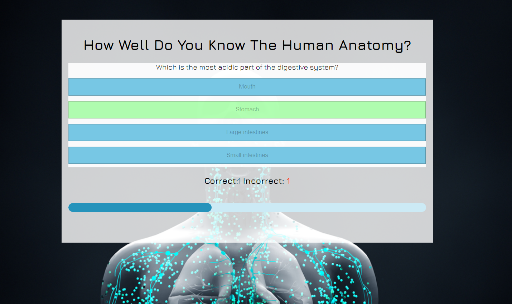
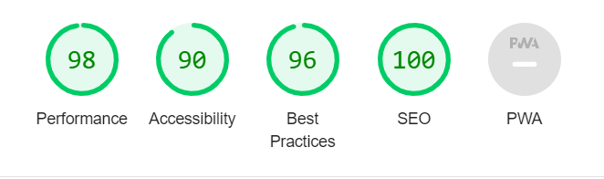

# Human Anatomy Quiz!

# Table of Contents
- [Purpose](#purpose)
- [UX Design](#ux-design) 
  * [Target audience](#target-audience)
  * [User stories](#user-stories)
- [Technologies](#technologies)  
- [Assumptions](#assumptions)
- [Constraints](#constraints)
- [Structure](#structure)
  * [Home Page](#home-page)
  * [Quiz Page](#quiz-page)
  * [Feedback Page](#feedback-page)
- [Wireframes](#wireframes)  
- [Design](#design)
- [Features](#features)
- [Technologies](#technologies-1)
- [Testing](#testing)
  * [User story testing](#user-story-testing)
  * [Feature testing](#feature-testing)
  * [Validator testing](#validator-testing)
- [Credits](#credits)  
- [Acknowledgements](#aknowledgements) 

# Purpose

The Human Anatomy Quiz aims to provide an engaging and educational experience for those interested in learning about human anatomy. It offers a fun way to test and expand knowledge of anatomical structures and functions through randomly selected questions. The quiz is designed to be interactive and enjoyable, suitable for students, educators, and anyone curious about anatomy. 

# Goal:

The goal of the quiz is to foster a deeper understanding of human anatomy through an interactive and dynamic learning tool. 

[Here's a link to the live website](https://stacykimberley.github.io/anatomy-quiz/)

# UX Design 

## Target audience

People of all ages with a specific interest in the human anatomy.

## User Stories

### As a first time user:

- I want to start the quiz after entering my username.
- I want to answer questions about human anatomy.
- I want to receive immediate feedback on my answers.
- I want to see my progress and score during the quiz.
- I want to retake the quiz if I am not satisfied with my score or just for more fun.
- I want to be able to use the application on different sized screens
- I want the feedback message to be personalised since I added my username.
- I want to go back to username if I want to change it.

### As a returning user:

- I want to find new questions added.
- I want to find new challenges added.

## Technologies:

- The quiz is developed using HTML, CSS, and JavaScript for frontend functionality.
- No backend server or database management system is included in the initial scope.

## Assumptions:

- Users have basic familiarity with web browsing and interacting with online quizzes.
- The quiz is designed for educational purposes and does not substitute professional medical advice or training.

## Constraints:

- The development of the quiz is limited to frontend technologies and does not involve server-side processing or data storage.
- Design considerations may be constrained by available resources and development timeframes.

## Structure

### Home Page

#### The home page is the face of the Anatomy Quiz website and has the following features:

- Title of the quiz "How well do you know the human anatomy?"
- Required username input so the user can enter their name before they start the quiz.
- Start button that redirects the user to the first question of the quiz.

### Quiz Page

- Title of the quiz "How well do you know the human anatomy?".
- A question.
- 4 answer options.
- Score area showing how many the user has got correct and incorrect.
- Progress bar to show how far along the quiz the user has gone.
- When answer is selected it highlights green if correct and if wrong it highlights the selected one in red then simultaneously shows you the correct answer.
- When an answer is selected it disables all the other selections to prevent cheating.

### Feedback Page.

- Congratulates the user by name for completing the quiz.
- Shows the user their final score.
- Shows a button to retake the quiz if the user wants to.
- Shows the progress bar at complete.
- When user restarts the Quiz they do not have to re-enter their name as it is stored in local storage and it resets the scores and progress bar.
- When a user clicks the End Quiz button it redirects them to the Home page.

## Wireframes

### Home Page

### Quiz Page

### Feedback Page

## Design

### Background Image

An image from iStock was used as a background image. It's an AI generated image of the immune system defending the body against infections and diseases. 

### Colors

Color pallete was mostly derived from the background image so everything looks well put together and  aesthetically pleasing. They also fit naturally with the human anatomy aesthetic: red for blood, blue represents life/ water and, black & white provide contrast between the background image and text.

### Font

Only one font (Jura) was used throughout the quiz for uniformity.

## Features

### Home Page

Homepage has title of the quiz, username input and a start button. The user is required to enter a username to start the quiz.

### Quiz Page

The quiz page shows a question and four answer options. When a correct answer is selected it highlights green.

When the wrong answer is selected, it highlights red then shows the correct answer simultaneously in green.

At the bottom of the game area there is a score count and progress bar.

### Feedback Page

Congratulatory message with username on completion.

 
Retake button to start the quiz again.

 

Final correct, incorrect score and the completed progress bar.

## Responsive Layout

The page is designed to be responsive on all screen sizes starting from 344pixels for mobile phones, 768 pixels for tablets and greater than 992pixels so it's aesthetically pleasing for laptops and slightly larger screens.

## Technologies

- HTML for website structure.
- CSS to style website.
- GitHub to store the source code and GitHub Pages to deploy and host the live site.
- Gitpod chosen IDE to develop the website.
- Google Fonts.
- Font Awesome for icons.
- Google Chrome Dev Tools.
- Favicon.cc 
- Coolors to choose color palette
- Techsini to create mockup of website on different iOS devices.
- Google chrome Lighthouse.
- Screen Reader for Google Chrome.
- Colorfilter.
- W3C HTML Markup Validator to validate HTML code.
- W3C Jigsaw CSS Validator to validate CSS code.
- Balsamiq for wireframes.
- Microsoft Word to create testing tables.
- Code Institute's Gitpod Template to generate the workspace for the project.
- Code institute learnings for general guidance.
- JavaScript for interactivity of the Quiz.
- iStock for background image.

## Testing 

### User Story Testing:

### Feature Testing:

### Validator Testing:

#### HTML on [W3C Validator](https://validator.w3.org/)

**Home Page**

No errors returned for index.html.

**Quiz Page**

An error returned because the retake button is a descendent of the a element. No changes being made to code at the moment.

#### CSS on [Jigsaw Validator](https://jigsaw.w3.org/css-validator/)

No errors returned for style.css.
 
#### Javascript on [JShint](https://jshint.com/)

28 warnings were initially returned after testing with jshint. 

After commenting the version name no errors were returned for both files, just the questions variable which was called in a separate file.

### Google Lighthouse 

#### Homepage

**Mobile**

**Desktop**

#### Quiz Page

**Mobile**

**Desktop**

## Create a repository

**The steps to create a repository on github are as follows:**

1. Go to github and sign in.
2. Once signed in, click the “+” icon in the top-right corner and select “New repository” from the dropdown menu.
3. Enter a unique name for your repository then set it to public.
4. Click the green “Create repository” button at the bottom to finalize the creation of your repository.

## Deployment

**This project was deployed to GitHub pages. The steps to deploy are as follows:**

1. Log into GitHub.
2. Select anatomy-quiz from the list of repositories.
3. Select Settings From the Repositories sub-headings.
4. In the left side menu select Pages from Code and automation section.
5. Under the Source heading in the dropdown menu select main.
6. A second drop-down menu should remain with the default value /(root).
7. Press Save.
8. A message that the website is ready to be deployed will appear, refresh the page and the link to the deployed site will be available in a green sub-section on the top of the page.
9. Click on the link to go to the live deployed page.

[Here's a link to the live website](https://stacykimberley.github.io/anatomy-quiz/)

## How to run this project Locally

**Clone the repository as follows:**

1. Navigate to the GitHub Repository anatomy-quiz.
2. Click the Code drop-down menu.
3. Click the HTTPS sub-heading under the Clone heading.
4. Copy the link.
5. Open an IDE of your choice (VSCode, Atom, Komodo, etc).
6. Open a terminal in the directory of your choice, type git clone and paste the link.
7. A clone of the repository will now be created on your machine.

## Download the repository manually

1. Navigate to the GitHub Repository anatomy-quiz.
2. Click the Code drop-down menu.
3. Click Download ZIP.
4. Locate the ZIP file and extract it to a folder where you want the repository to be stored.
5. Open an IDE of your choice (VSCode, Atom, Komodo, etc).
6. Navigate to the directory where the repository was extracted.
7. Now you will have the contents of the project available offline on your machine.

## Credits

### Content

- Questions found and selected [here](https://quizglobal.com/quizplay/quizplayqanda/Human%20Body%20Quiz).

### Media

- Backround image by Design Cells from [iStock](https://www.istockphoto.com/photo/immune-system-defends-the-body-against-infections-and-diseases-gm1215808778-354268567?clarity=false).

### Code

- CSS code to highlight selected answers and change from cursor to pointer when selecting answers from Hazel Hawadi.

- local storage javascript learnt from [here](https://gamedevjs.com/articles/using-local-storage-for-high-scores-and-game-progress/#:~:text=Local%20storage%20is%20a%20powerful,if%20the%20browser%20supports%20it) and modified.

- Javascript learnings from Code institure lessons.
- Structure for questions.js found [here](https://github.com/siobhanlgorman/80s-Mixtape-Quiz) and modified.

## Acknowledgements

I would like to express my gratitude to the following individuals for their contributions and support:

My mentor, Ronan McClelland for great support, advice, learning reasources and guidance throughout this project.

My sister Hazel Hawadi for moral support and help with coding.

Amy Richardson(Cohort Facilitator) for her regular check-ins and support.

